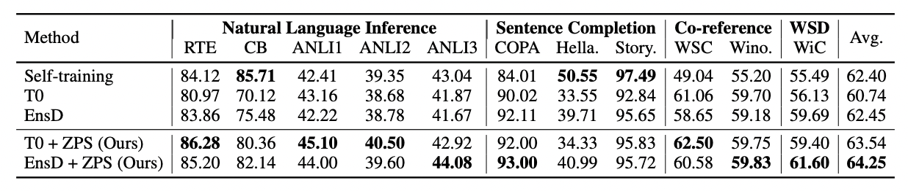
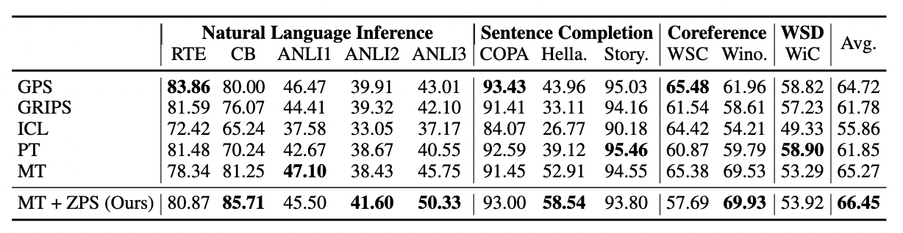

# Zero-Label Prompt Selection

This repository contains the official code for ZPS.

In our paper, we provide ZPS, an algorithm for zero-label prompt selection. ZPS choose a optimal prompt from the manual prompt candidates without labeled data or parameter update.

You should be able to reproduce these main results with our code.
- Zero-label
    
- Few-shot
    


## Contents
We provide code for both zero-label setting and few-shot setting. Including
- Zero-label
    - ZPS
    - Self-training
- Few-shot
    - ICL
    - GPS
    - GRIPS
    - Model-tuning
    - Prompt-tuning


The details to reproduce the main results can be found in [SRC](src/README.md).


## Citation
Please cite us if ZPS is useful in your work:
```
@misc{2211.04668,
Author = {Chonghua Liao and Yanan Zheng and Zhilin Yang},
Title = {Zero-Label Prompt Selection},
Year = {2022},
Eprint = {arXiv:2211.04668},
}
```

## Acknowledgement
Part of the code is based on [T0](https://github.com/bigscience-workshop/t-zero).
We appreciate all the contributors who made their code & dataset public, which greatly advanced this ZPS project. This repository will be continuously updated.

